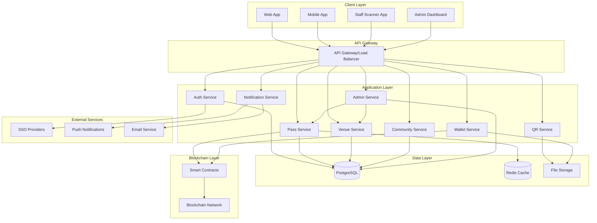

# Design Document

## Overview

The Queue Skip Web3 system is designed as a multi-tenant, blockchain-integrated platform that provides configurable queue management solutions. The architecture emphasizes modularity, scalability, and flexibility to support diverse venue types from transit stations to commercial buildings globally. The system combines traditional web technologies with Web3 infrastructure to ensure transparency while maintaining user experience standards.

## Architecture

### High-Level Architecture



### Multi-Tenant Architecture

The system employs a shared infrastructure model with tenant isolation:

- **Venue-Level Isolation**: Each venue (HKU station, commercial building, etc.) operates as a separate tenant
- **Shared Services**: Core services are shared across tenants for efficiency
- **Configuration-Driven**: Tenant-specific behavior controlled through configuration rather than code changes
- **Data Isolation**: Logical separation of tenant data with physical sharing of infrastructure

## Components and Interfaces

### 1. Authentication Service

**Purpose**: Manages multi-method authentication and user identity across venues

**Key Features**:
- SSO integration (SAML, OAuth2, OpenID Connect)
- Government ID verification
- Web3 wallet authentication
- Multi-factor authentication support

**Interfaces**:
```typescript
interface AuthService {
  authenticateUser(method: AuthMethod, credentials: AuthCredentials): Promise<AuthResult>
  validateToken(token: string): Promise<UserContext>
  assignUserToGroups(userId: string, venueId: string): Promise<UserGroup[]>
  configureAuthMethods(venueId: string, config: AuthConfig): Promise<void>
}

interface AuthMethod {
  type: 'sso' | 'government_id' | 'email' | 'web3_wallet'
  provider?: string
  priority: number
}
```

### 2. Pass Service

**Purpose**: Core pass lifecycle management including creation, allocation, transfer, and redemption

**Key Features**:
- Configurable pass types and allocation rules
- Automated distribution scheduling
- Pass transfer functionality
- Usage analytics and predictions

**Interfaces**:
```typescript
interface PassService {
  allocatePasses(userId: string, venueId: string): Promise<Pass[]>
  createPass(userId: string, passType: PassType, venueId: string): Promise<Pass>
  transferPass(passId: string, fromUserId: string, toUserId: string): Promise<TransferResult>
  redeemPass(passId: string, staffId: string): Promise<RedemptionResult>
  getPassPredictions(venueId: string, date: Date): Promise<UsagePrediction[]>
}

interface Pass {
  id: string
  userId: string
  venueId: string
  type: PassType
  status: 'active' | 'used' | 'expired' | 'transferred'
  validFrom: Date
  validUntil: Date
  restrictions: PassRestriction[]
  blockchainTxHash?: string
}
```

### 3. Venue Service

**Purpose**: Manages venue configuration, feature toggles, and administrative settings

**Key Features**:
- Venue-specific configuration management
- Feature toggle system
- User group definitions
- Integration settings for external systems

**Interfaces**:
```typescript
interface VenueService {
  createVenue(config: VenueConfig): Promise<Venue>
  updateVenueConfig(venueId: string, config: Partial<VenueConfig>): Promise<void>
  getVenueConfig(venueId: string): Promise<VenueConfig>
  toggleFeature(venueId: string, feature: FeatureFlag, enabled: boolean): Promise<void>
}

interface VenueConfig {
  id: string
  name: string
  type: 'transit' | 'commercial' | 'tourist' | 'government'
  authMethods: AuthMethod[]
  passTypes: PassType[]
  userGroups: UserGroup[]
  features: FeatureFlags
  integrations: ExternalIntegration[]
}
```

### 4. QR Service

**Purpose**: Generates secure, dynamic QR codes and manages validation

**Key Features**:
- Dynamic QR codes that refresh every 30 seconds
- Cryptographically signed QR codes with time-based tokens
- Anti-forgery and replay attack prevention
- Staff scanner integration with real-time validation

**Cost Considerations for Dynamic QR**:
- **Server Resources**: Minimal - QR generation is computationally light
- **Database Load**: Low - only stores current token hash, not full QR data
- **Network Traffic**: Moderate - 30-second refresh requires WebSocket or polling
- **Overall Impact**: Cost increase is minimal (~5-10% of total infrastructure cost)

**Interfaces**:
```typescript
interface QRService {
  generateDynamicQR(passId: string): Promise<DynamicQRCode>
  refreshQRCode(passId: string): Promise<QRCode>
  validateQR(qrData: string, staffId: string): Promise<ValidationResult>
  createTimedToken(passId: string, venueId: string, validFor: number): Promise<string>
  getWebQRDisplay(passId: string): Promise<string> // fallback URL
}

interface DynamicQRCode {
  currentCode: QRCode
  refreshUrl: string
  webDisplayUrl: string
  refreshInterval: number // 30 seconds
}

interface QRCode {
  data: string
  imageUrl: string
  expiresAt: Date
  signature: string
  tokenHash: string
}
```

### 5. Wallet Service

**Purpose**: Manages Apple Wallet integration and .pkpass file generation

**Key Features**:
- Apple Wallet (.pkpass) generation with dynamic QR updates
- Real-time pass status synchronization
- Wallet pass updates via push notifications
- Fallback web-based QR display

**Interfaces**:
```typescript
interface WalletService {
  generatePkPass(passId: string): Promise<PkPassFile>
  updatePassStatus(passId: string, status: PassStatus): Promise<void>
  generateDynamicQR(passId: string): Promise<DynamicQRCode>
  syncWithWallet(userId: string): Promise<SyncResult>
}

interface DynamicQRCode {
  currentCode: string
  expiresAt: Date
  refreshInterval: number // 30 seconds
  webUrl: string // fallback web display
}
```

### 6. Admin Service

**Purpose**: Comprehensive administrative interface for venue setup and management

**Key Features**:
- Venue onboarding and configuration wizard
- Real-time analytics and usage monitoring
- User group management and access control
- Feature toggle management with preview mode
- Bulk operations for pass management
- Integration setup for external systems

**Interfaces**:
```typescript
interface AdminService {
  // Venue Management
  onboardVenue(adminUser: User, venueData: VenueSetupData): Promise<VenueSetupResult>
  getVenueAnalytics(venueId: string, timeRange: TimeRange): Promise<VenueAnalytics>
  
  // User Group Management
  createUserGroup(venueId: string, groupConfig: UserGroupConfig): Promise<UserGroup>
  bulkAssignUsers(venueId: string, userIds: string[], groupId: string): Promise<BulkResult>
  
  // Pass Management
  bulkAllocatePasses(venueId: string, allocation: BulkAllocation): Promise<AllocationResult>
  getPassUsageReport(venueId: string, filters: ReportFilters): Promise<UsageReport>
  
  // Feature Management
  previewFeatureToggle(venueId: string, feature: FeatureFlag, enabled: boolean): Promise<PreviewResult>
  scheduleFeatureToggle(venueId: string, feature: FeatureFlag, schedule: ToggleSchedule): Promise<void>
  
  // Integration Management
  setupSSO(venueId: string, ssoConfig: SSOConfig): Promise<IntegrationResult>
  testIntegration(venueId: string, integrationType: string): Promise<TestResult>
}

interface VenueSetupData {
  name: string
  type: VenueType
  location: Location
  operatingHours: OperatingHours
  expectedCapacity: number
  initialConfig: VenueConfig
}

interface VenueAnalytics {
  totalUsers: number
  activeUsers: number
  passesIssued: number
  passesRedeemed: number
  peakUsageTimes: TimeSlot[]
  userGroupBreakdown: GroupStats[]
  revenueImpact?: number
}
```

### 7. Blockchain Service

**Purpose**: Manages Web3 integration via WalletConnect with Solana as primary chain

**Key Features**:
- Solana blockchain integration for low fees and high speed
- WalletConnect v2 for multi-wallet support
- Pass NFT minting and management on Solana
- Transaction transparency with minimal gas costs

**Interfaces**:
```typescript
interface BlockchainService {
  connectWallet(walletType: string): Promise<WalletConnection>
  mintPassNFT(pass: Pass): Promise<string>
  transferPassNFT(passId: string, fromAddress: string, toAddress: string): Promise<string>
  redeemPassNFT(passId: string): Promise<string>
  getTransactionHistory(passId: string): Promise<Transaction[]>
}

interface WalletConnection {
  address: string
  chainId: string
  walletType: 'phantom' | 'solflare' | 'metamask' | 'other'
  connected: boolean
}
```

## Data Models

### Core Entities

```typescript
// User Management
interface User {
  id: string
  email?: string
  governmentId?: string
  web3Address?: string
  ssoId?: string
  createdAt: Date
  lastLoginAt: Date
}

interface UserVenueAssociation {
  userId: string
  venueId: string
  userGroup: string
  joinedAt: Date
  status: 'active' | 'suspended' | 'banned'
}

// Pass Management
interface PassType {
  id: string
  venueId: string
  name: string
  description: string
  restrictions: PassRestriction[]
  validityPeriod: number // in hours
  transferable: boolean
}

interface PassRestriction {
  type: 'time_window' | 'day_of_week' | 'usage_count'
  value: string
}

interface PassAllocation {
  id: string
  venueId: string
  userGroup: string
  passTypeId: string
  quantity: number
  period: 'daily' | 'weekly' | 'monthly' | 'semester'
  autoRenew: boolean
}

// Venue Configuration
interface Venue {
  id: string
  name: string
  type: string
  address: string
  timezone: string
  config: VenueConfig
  createdAt: Date
}

interface FeatureFlags {
  passTransfer: boolean
  communityForum: boolean
  passExpiration: boolean
  governmentIdRequired: boolean
  oneTimePasses: boolean
  surveyRequired: boolean
  usagePredictions: boolean
}

// Community Features
interface DonationRequest {
  id: string
  userId: string
  venueId: string
  reason: string
  upvotes: number
  status: 'open' | 'fulfilled' | 'closed'
  createdAt: Date
}

// Analytics
interface UsagePrediction {
  venueId: string
  date: Date
  timeSlot: string
  expectedPasses: number
  confidence: number
}
```

### Blockchain Data Models

**Solana Program Structure** (using Anchor framework):

```rust
// Solana Program for Queue Pass NFTs
#[program]
pub mod queue_pass_nft {
    use super::*;
    
    pub fn mint_pass(
        ctx: Context<MintPass>,
        venue_id: String,
        pass_type: String,
        valid_from: i64,
        valid_until: i64,
        metadata_uri: String,
    ) -> Result<()> {
        // Mint NFT with pass metadata
    }
    
    pub fn transfer_pass(
        ctx: Context<TransferPass>,
        pass_id: Pubkey,
    ) -> Result<()> {
        // Transfer pass ownership
    }
    
    pub fn redeem_pass(
        ctx: Context<RedeemPass>,
        pass_id: Pubkey,
    ) -> Result<()> {
        // Mark pass as redeemed
    }
}

#[account]
pub struct QueuePass {
    pub owner: Pubkey,
    pub venue_id: String,
    pub pass_type: String,
    pub valid_from: i64,
    pub valid_until: i64,
    pub redeemed: bool,
    pub metadata_uri: String,
    pub mint: Pubkey,
}
```

**WalletConnect Integration**:
- Supports Phantom, Solflare, and other Solana wallets
- Cross-chain capability for future expansion
- Mobile wallet deep-linking
- Session management for persistent connections

## Error Handling

### Error Categories

1. **Authentication Errors**
   - Invalid credentials
   - Expired tokens
   - Insufficient permissions
   - SSO provider unavailable

2. **Pass Management Errors**
   - Pass not found
   - Pass already redeemed
   - Pass expired
   - Transfer not allowed
   - Allocation limit exceeded

3. **Blockchain Errors**
   - Transaction failed
   - Insufficient gas
   - Network congestion
   - Smart contract error

4. **Integration Errors**
   - SSO provider timeout
   - Wallet service unavailable
   - QR generation failed
   - External API errors

### Error Response Format

```typescript
interface ErrorResponse {
  code: string
  message: string
  details?: any
  timestamp: Date
  requestId: string
  retryable: boolean
}
```

### Retry and Fallback Strategies

- **Blockchain Operations**: Automatic retry with exponential backoff, fallback to database-only mode
- **External Services**: Circuit breaker pattern, graceful degradation
- **QR Generation**: Local fallback generation, cached templates
- **Wallet Integration**: Offline mode support, manual sync options

## Testing Strategy

### Unit Testing
- **Service Layer**: Mock external dependencies, test business logic
- **Data Layer**: In-memory database for repository tests
- **Blockchain**: Local test network (Hardhat/Ganache)
- **Coverage Target**: 90% code coverage

### Integration Testing
- **API Endpoints**: Full request/response cycle testing
- **Database Operations**: Real database with test data
- **Blockchain Integration**: Testnet deployment
- **External Services**: Mock servers for SSO, notifications

### End-to-End Testing
- **User Flows**: Complete pass lifecycle from allocation to redemption
- **Multi-Venue Scenarios**: Cross-venue functionality
- **Mobile Wallet Integration**: Automated mobile testing
- **Staff Scanner Workflows**: QR scanning and validation

### Performance Testing
- **Load Testing**: Concurrent user scenarios
- **Blockchain Performance**: Gas optimization testing
- **Database Performance**: Query optimization
- **Mobile Performance**: App responsiveness testing

### Security Testing
- **Authentication**: Penetration testing of auth flows
- **QR Security**: Forgery and replay attack testing
- **Blockchain Security**: Smart contract auditing
- **Data Privacy**: GDPR compliance testing

## Administrator Experience

### Venue Onboarding Flow

1. **Initial Setup Wizard**
   - Venue type selection (transit, commercial, tourist, government)
   - Basic information (name, location, capacity, operating hours)
   - Administrator account creation

2. **Authentication Configuration**
   - Choose authentication methods (SSO, government ID, email, Web3)
   - Configure SSO providers with guided setup
   - Test authentication flows

3. **User Group Definition**
   - Define user categories (employees, residents, students, public, tourists)
   - Set pass allocation rules per group
   - Configure access restrictions

4. **Feature Selection**
   - Enable/disable features based on needs
   - Preview feature impact with sample data
   - Set up community features if desired

5. **Integration Setup**
   - Connect existing gate/access systems
   - Configure staff scanner applications
   - Set up notification preferences

6. **Testing & Launch**
   - Test environment with sample passes
   - Staff training materials and scanner setup
   - Gradual rollout options

### Admin Dashboard Features

- **Real-time Monitoring**: Live pass usage, queue predictions, system health
- **Analytics**: Usage patterns, user behavior, capacity optimization
- **User Management**: Bulk operations, group assignments, access control
- **Pass Management**: Allocation rules, bulk distribution, usage reports
- **Feature Toggles**: A/B testing, gradual rollouts, emergency controls
- **Integration Status**: SSO health, blockchain sync, external system status

## Technical Considerations

### Dynamic QR Code Implementation

**Cost Analysis**:
- **Computational Cost**: QR generation is lightweight (~1ms per code)
- **Storage Cost**: Minimal - only current token hash stored
- **Network Cost**: WebSocket connections for real-time updates
- **Total Impact**: Estimated 5-10% increase in infrastructure costs

**Implementation Options**:
1. **WebSocket Updates**: Real-time push to mobile apps
2. **Polling Fallback**: 30-second intervals for web browsers
3. **Progressive Web App**: Offline capability with cached tokens

### Solana + WalletConnect Benefits

- **Low Transaction Costs**: ~$0.00025 per transaction vs Ethereum's $5-50
- **High Throughput**: 65,000 TPS vs Ethereum's 15 TPS
- **Mobile-First**: Native mobile wallet support
- **Multi-Chain Ready**: WalletConnect enables future chain expansion
- **Developer Experience**: Anchor framework simplifies smart contract development

The design emphasizes modularity and configurability to support the diverse requirements across different venue types while maintaining security, performance, and user experience standards. The blockchain integration provides transparency without compromising system performance through hybrid on-chain/off-chain architecture.